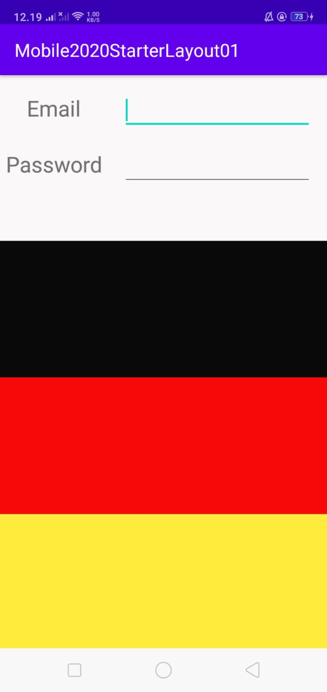

```
TextView
    android:id="@+id/textView"
    android:layout_width="wrap_content"
    android:layout_height="wrap_content"
    android:layout_marginStart="16dp"
    android:layout_marginEnd="16dp"
    android:text="Email"
    android:textSize="24sp"
    app:layout_constraintBaseline_toBaselineOf="@+id/editTextTextPersonName"
    app:layout_constraintEnd_toStartOf="@+id/guideline"
    app:layout_constraintStart_toStartOf="parent" />
```

Tag TextView diatas merupakan label ”Email” yang dihubungkan pada Tag EditText dengan id “editTextTextPersonName” dengan tinggi dan lebar yang melingkupi areanya. Serta margin kiri 16dp dan margin kanan 16dp dengan ukuran text 24sp.

```
<EditText
    android:id="@+id/editTextTextPersonName"
    android:layout_width="0dp"
    android:layout_height="wrap_content"
    android:layout_marginStart="16dp"
    android:layout_marginTop="16dp"
    android:layout_marginEnd="16dp"
    android:ems="10"
    android:inputType="textPersonName"
    app:layout_constraintEnd_toEndOf="parent"
    app:layout_constraintStart_toStartOf="@+id/guideline"
    app:layout_constraintTop_toTopOf="parent" />
```

Tag EditText diatas merupakan tag untuk mengambil inputan dari user dengan id “editTextTextPersonName” dengan lebar yang mengikuti constraintnya dan tinggi yang melingkupi areanya. Serta margin kiri 16dp dan margin kanan 16dp .Type dari input yang digunakan merupakan “textPersonName” atau tipe inputan biasa seperti pada umunya.

```
<androidx.constraintlayout.widget.Guideline
    android:id="@+id/guideline"
    android:layout_width="wrap_content"
    android:layout_height="wrap_content"
    android:orientation="vertical"
    app:layout_constraintGuide_percent="0.33" />
```

Tag diatas merupakan objek pembantu dari Constraint Layout yang disebut Guideline. Guideline merupakan garis yang dapat diatur untuk membagi layar. Guideline tidak Nampak pada device (view.GONE). Pada code diatas, lebar dan tinggi Guideline melingkupi area dengan orientasi vertical dan diatur untuk membagi layar menjadi 0.33 / 30%.

```
<TextView
    android:id="@+id/textView3"
    android:layout_width="wrap_content"
    android:layout_height="wrap_content"
    android:layout_marginStart="16dp"
    android:layout_marginEnd="16dp"
    android:text="Password"
    android:textSize="24sp"
    app:layout_constraintBaseline_toBaselineOf="@+id/editTextTextPassword"
    app:layout_constraintEnd_toStartOf="@+id/guideline"
    app:layout_constraintStart_toStartOf="parent" />
    
 ```

Tag TextView diatas merupakan label ”Password” yang dihubungkan pada Tag EditText dengan id “editTextTextPassword” dengan tinggi dan lebar yang melingkupi areanya. Serta margin kiri 16dp dan margin kanan 16dp dengan ukuran text 24sp.

```
<EditText
    android:id="@+id/editTextTextPassword"
    android:layout_width="0dp "
    android:layout_height="wrap_content"
    android:layout_marginStart="16dp"
    android:layout_marginTop="16dp"
    android:layout_marginEnd="16dp"
    android:ems="10"
    android:inputType="textPassword"
    app:layout_constraintEnd_toEndOf="parent"
    app:layout_constraintStart_toStartOf="@+id/guideline"
    app:layout_constraintTop_toBottomOf="@+id/editTextTextPersonName" />
```

Tag EditText diatas merupakan tag untuk mengambil inputan dari user dengan id “editTextTextPassword” dengan lebar yang mengikuti constraintnya dan tinggi yang melingkupi areanya. Serta margin kiri 16dp dan margin kanan 16dp .Type dari input yang digunakan merupakan “textPassword” atau tipe inputan dimana user itu sendiri tidak dapat melihat inputannya (Berubah jadi titik-titik hitam).

```
<ImageView
    android:id="@+id/imageView2"
    android:layout_width="0dp"
    android:layout_height="0dp"
    android:src="@drawable/liquid"
    app:layout_constraintBottom_toBottomOf="parent"
    app:layout_constraintEnd_toEndOf="parent"
    app:layout_constraintStart_toStartOf="parent"
    app:layout_constraintTop_toBottomOf="@+id/editTextTextPassword" />
```

Tag ImageView diatas merupakan tag untuk menampilkan gambar dengan id imageView2. Gambar yang digunakan adalah liquid dari ekstensi drawable. Sisi kiri, kanan, dan bawah gambar ini mengikuti area lingkupnya sementara sisi atas bergantung pada sisi bawah dari tag EditText dengan id “editTextTextPassword”.

**Screenshoot Tugas**


